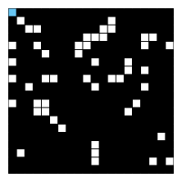
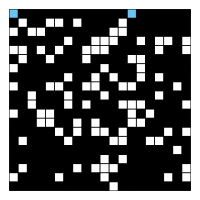

# Percolation


Write a program to estimate the value of the _percolation threshold_ via Monte Carlo simulation.

**Percolation.** Given a composite systems comprised of randomly distributed insulating and metallic materials: what 
fraction of the materials need to be metallic so that the composite system is an electrical conductor? Given a porous 
landscape with water on the surface (or oil below), under what conditions will the water be able to drain through to 
the bottom (or the oil to gush through to the surface)? Scientists have defined an abstract process known as 
_percolation_ to model such situations.

**The model.** We model a percolation system using an _n_\-by-_n_ grid of _sites_. Each site is either _open_ or 
_blocked_. A _full_ site is an open site that can be connected to an open site in the top row via a chain of 
neighboring (left, right, up, down) open sites. We say the system _percolates_ if there is a full site in the bottom 
row. In other words, a system percolates if we fill all open sites connected to the top row and that process fills some 
open site on the bottom row. (For the insulating/metallic materials example, the open sites correspond to metallic 
materials, so that a system that percolates has a metallic path from top to bottom, with full sites conducting. For the 
porous substance example, the open sites correspond to empty space through which water might flow, so that a system that 
percolates lets water fill open sites, flowing from top to bottom.)

| Percolates                               | Does not percolate                              |
|------------------------------------------|-------------------------------------------------|
|  |  |

**The problem.** In a famous scientific problem, researchers are interested in the following question: if sites are 
independently set to be open with probability _p_ (and therefore blocked with probability 1 − _p_), what is the 
probability that the system percolates? When _p_ equals 0, the system does not percolate; when _p_ equals 1, the system 
percolates. The plots below show the site vacancy probability _p_ versus the percolation probability for 20-by-20 random 
grid (left) and 100-by-100 random grid (right).

| Threshold for 20-by-20 grid              | Threshold for 100-by-100 grid                   |
|------------------------------------------|-------------------------------------------------|
|  |  |
         

When _n_ is sufficiently large, there is a _threshold_ value _p_\* such that when _p_ < _p_\* a random _n_\-by-_n_ grid 
almost never percolates, and when _p_ > _p_\*, a random _n_\-by-_n_ grid almost always percolates. No mathematical 
solution for determining the percolation threshold _p_\* has yet been derived. Your task is to write a computer program
to estimate _p_\*.

**Percolation data type.** To model a percolation system, create an interface `Percolation` with the following API:
```go
type Percolation interface {
    // opens the site (row, col) if it is not open already
    Open(row int, col int)
    // is the site (row, col) open?
    IsOpen(row int, col int) bool
    // is the site (row, col) full?
    IsFull(row int, col int) bool
    // returns the number of open sites
    NumberOfOpenSites() int
    // does the system percolate?
    Percolates() bool
}
```
_Corner cases. _ By convention, the row and column indices are integers between 1 and _n_, where (1, 1) is the 
upper-left site.

_Performance requirements. _ The constructor must take time proportional to _n_2; all instance methods must take 
constant time plus a constant number of calls to `Union()` and `Find()`.

**Monte Carlo simulation.** To estimate the percolation threshold, consider the following computational experiment:

*   Initialize all sites to be blocked.
*   Repeat the following until the system percolates:
    *   Choose a site uniformly at random among all blocked sites.
    *   Open the site.
*   The fraction of sites that are opened when the system percolates provides an estimate of the percolation threshold.

For example, if sites are opened in a 20-by-20 lattice according to the snapshots below, then our estimate of the 
percolation threshold is 204/400 = 0.51 because the system percolates when the 204th site is opened.

| Percolation 50 sites | Percolation 100 sites | Percolation 150 sites | Percolation 204 sites |
|----------------------|-----------------------|-----------------------|-----------------------|
|  |  |  |  |

By repeating this computation experiment _T_ times and averaging the results, we obtain a more accurate estimate of the 
percolation threshold.
To perform a series of computational experiments, implement an interface `PercolationStats` with the following API.
```go
type PercolationStats interface {
    // perform independent trials on an n-by-n grid
    PercolationStats(n int, trials int)
    // sample mean of percolation threshold
    Mean() int
    // sample standard deviation of percolation threshold
    Stddev() int
    // low endpoint of 95% confidence interval
    ConfidenceLo() int
    // high endpoint of 95% confidence interval
    ConfidenceHi() int
}
```

Also, include a `main()` function that takes two _command-line arguments_ _n_ and _T_, performs _T_ independent 
computational experiments (discussed above) on an _n_\-by-_n_ grid, and prints the sample mean, sample standard 
deviation, and the _95% confidence interval_ for the percolation threshold. 
```
> ~/Desktop/percolation> go run PercolationStats.go 200 100
> mean                    = 0.5929934999999997
> stddev                  = 0.00876990421552567
> 95% confidence interval = \[0.5912745987737567, 0.5947124012262428\]
> 
> ~/Desktop/percolation> go run PercolationStats.go 200 100
> mean                    = 0.592877
> stddev                  = 0.009990523717073799
> 95% confidence interval = \[0.5909188573514536, 0.5948351426485464\]
> 
> ~/Desktop/percolation> go run PercolationStats.go 2 10000
> mean                    = 0.666925
> stddev                  = 0.11776536521033558
> 95% confidence interval = \[0.6646167988418774, 0.6692332011581226\]
> 
> ~/Desktop/percolation> go run PercolationStats.go 2 100000
> mean                    = 0.6669475
> stddev                  = 0.11775205263262094
> 95% confidence interval = \[0.666217665216461, 0.6676773347835391\]
```

This assignment was developed by Bob Sedgewick and Kevin Wayne.  
Copyright © 2008.
